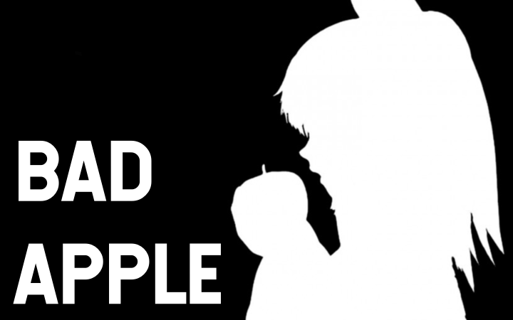

# SE Bad Apple.

Getting the bad apple shadow video to play in Space Engineers.

## Goals
- Show that Space Engineers is the superior game by playing this https://www.nicovideo.jp/watch/sm8628149 video in-game.
- Premium 30fps.
- Use vanilla fonts monospace.
- Minimal setup to allow player to set this up on servers (rip. the lag).

## But it's Already been done.
https://www.youtube.com/watch?v=Uby7YnPoAWk

Yes! De/Code has already done it. However it requires a special font that uses braille.

## How do I?

**Prerequisites**
- A way to compile [Rust](https://www.rust-lang.org/tools/install).
- Have [MDK-SE](https://github.com/malware-dev/MDK-SE) installed.
- Have [Ffmpeg](https://ffmpeg.org/download.html) installed.

1. Clone this Repo.
2. Create a directory called `frames`.
3. Run the following ffmpeg command to populate the frames directory with the frames from the video.
    > ffmpeg -i bad-apple-72p.webm frames/%05d.bmp
4. `cd pre-processor` and run `cargo run > frames.txt` to pre-process each frame.
5. Build the bad-apple-script with the MDK plugin for visual studio (or copy the relevant section from `Program.cs`).
6. Place a programmable block and a LCD named "Bad Apple LCD".
7. Load the bad apple script on the programmable block.
8. copy the contents of frames.txt and paste it into the custom data of the programmable block with the script.
9. ???
10. Profit.